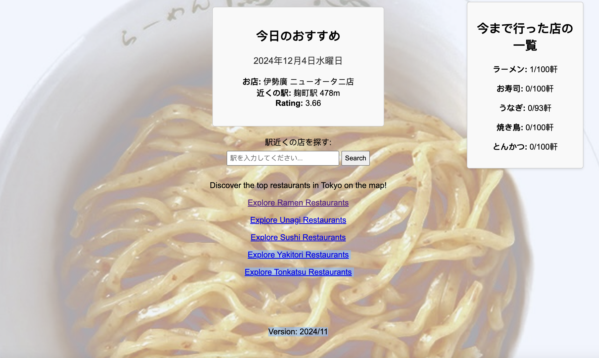
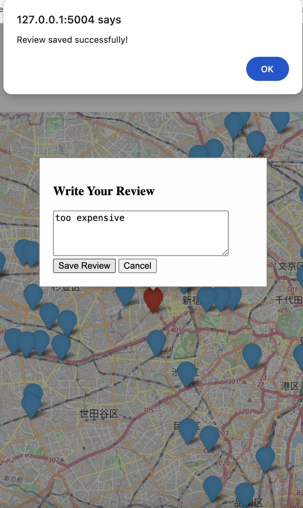

# Tokyo Cuisine Map

As a Food Hunter used to be living in Tokyo, I collected information about many restaurants in Tokyo including all genres. 

This project can serve as your personal pocket guide to explore great food in Tokyo. You can mark the places you have visited, save your comments and reviews, and get your daily recommendations or use it as a search engine. 

You can simply build from source using docker. 

To build the image:

`docker build -t tokyo_cuisine`

Run with either click the run button in Docker or use the command below.

`docker run -d -p 5004:5004 --name my_tokyo_cuisine tokyo_cuisine`

Feel free to modify settings in the config, you can add/remove genres to tailor your own version of maps.

## Landing Page

## Map Page

You can tick on 'Visited' to mark the restaurants you have already been to. 

You can add your own reviews or remarks of the restaurants, it will be automatically saves in the backend. 

